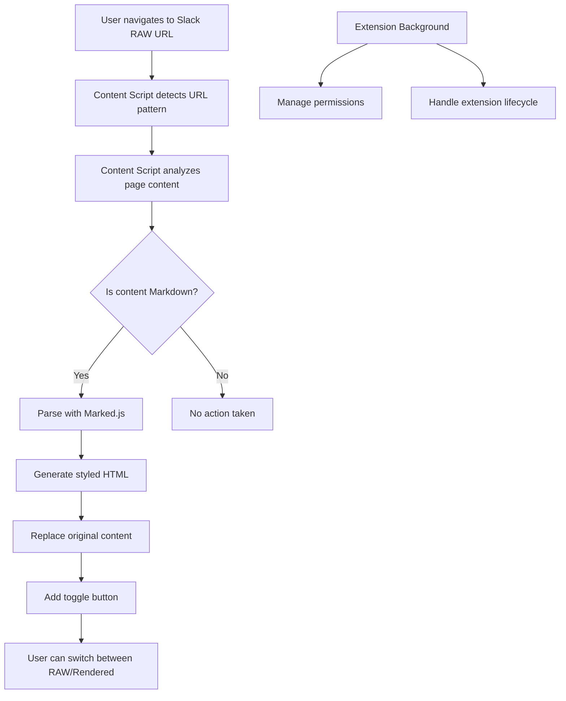

# Design Document

## Overview

SlackのRAWファイル表示ページでMarkdown記法を自動的にレンダリングするChrome拡張機能の設計。この拡張機能は、Manifest V3を使用してSlackのRAWファイルURL（`https://files.slack.com/files-pri/*`）を検出し、Markdownコンテンツを適切にフォーマットされたHTMLとして表示する。

主要な技術スタック：
- Chrome Extension Manifest V3
- Content Scripts for DOM manipulation
- Marked.js for Markdown parsing
- CSS for styling and theming

## Architecture



### Component Architecture

1. **Manifest Configuration**: Defines extension metadata, permissions, and content script injection rules
2. **Content Script**: Main logic for detecting, parsing, and rendering Markdown content
3. **Markdown Parser**: Marked.js library for converting Markdown to HTML
4. **Style Engine**: CSS styling system for rendered content
5. **Toggle Controller**: UI component for switching between RAW and rendered views

## Components and Interfaces

### Manifest Configuration (manifest.json)

```json
{
  "manifest_version": 3,
  "name": "Slack Markdown Renderer",
  "version": "1.0.0",
  "description": "Renders Markdown content in Slack RAW file pages",
  "permissions": ["activeTab"],
  "content_scripts": [
    {
      "matches": ["https://files.slack.com/files-pri/*"],
      "js": ["lib/marked.min.js", "content-script.js"],
      "css": ["styles.css"],
      "run_at": "document_idle"
    }
  ]
}
```

### Content Script Interface

```typescript
interface ContentScript {
  // Core functionality
  detectMarkdownContent(): boolean;
  parseMarkdown(content: string): string;
  renderContent(html: string): void;
  
  // UI controls
  createToggleButton(): HTMLElement;
  toggleView(mode: 'raw' | 'rendered'): void;
  
  // Utility functions
  extractTextContent(): string;
  applyStyles(): void;
  isSlackRawPage(): boolean;
}
```

### Markdown Parser Interface

```typescript
interface MarkdownParser {
  parse(markdown: string): string;
  setOptions(options: MarkedOptions): void;
}

interface MarkedOptions {
  breaks: boolean;
  gfm: boolean;
  sanitize: boolean;
  highlight?: (code: string, lang: string) => string;
}
```

### Style Controller Interface

```typescript
interface StyleController {
  applyBaseStyles(): void;
  applyMarkdownStyles(): void;
  setBackgroundColor(color: string): void;
  toggleDarkMode(enabled: boolean): void;
}
```

## Data Models

### Page State Model

```typescript
interface PageState {
  isSlackRawPage: boolean;
  hasMarkdownContent: boolean;
  currentView: 'raw' | 'rendered';
  originalContent: string;
  renderedContent: string;
  toggleButton: HTMLElement | null;
}
```

### Content Detection Model

```typescript
interface ContentAnalysis {
  isMarkdown: boolean;
  confidence: number; // 0-1 scale
  detectedFeatures: MarkdownFeature[];
  fileExtension: string | null;
}

enum MarkdownFeature {
  HEADERS = 'headers',
  LISTS = 'lists',
  CODE_BLOCKS = 'code_blocks',
  LINKS = 'links',
  EMPHASIS = 'emphasis'
}
```

### Configuration Model

```typescript
interface ExtensionConfig {
  autoRender: boolean;
  defaultView: 'raw' | 'rendered';
  backgroundColor: string;
  fontSize: string;
  theme: 'light' | 'dark' | 'auto';
}
```

## Correctness Properties

*A property is a characteristic or behavior that should hold true across all valid executions of a system-essentially, a formal statement about what the system should do. Properties serve as the bridge between human-readable specifications and machine-verifiable correctness guarantees.*

### Property 1: URL Pattern Detection
*For any* URL string, the extension should activate if and only if the URL matches the pattern `https://files.slack.com/files-pri/*`
**Validates: Requirements 1.1, 1.2**

### Property 2: Content Analysis Consistency
*For any* page content, the content analysis function should consistently identify the same content type when called multiple times
**Validates: Requirements 1.3**

### Property 3: Markdown Detection Accuracy
*For any* content that contains Markdown syntax patterns (headers, lists, code blocks, links, emphasis), the extension should detect it as Markdown content
**Validates: Requirements 1.4, 4.3**

### Property 4: Markdown Parsing Round Trip
*For any* valid Markdown content, parsing it with the Markdown parser should produce valid HTML that contains the semantic structure of the original content
**Validates: Requirements 2.1, 2.2**

### Property 5: DOM Replacement Integrity
*For any* original content that gets replaced with rendered content, the toggle function should be able to restore the exact original content
**Validates: Requirements 2.3, 3.3, 3.4**

### Property 6: File Extension Recognition
*For any* file with `.md` or `.markdown` extension, the extension should treat it as Markdown content
**Validates: Requirements 4.1, 4.2**

### Property 7: Non-Markdown Content Preservation
*For any* content that is not Markdown, the extension should not modify the original page display
**Validates: Requirements 4.4**

### Property 8: Toggle State Consistency
*For any* toggle operation between RAW and rendered views, the current view state should always match the displayed content
**Validates: Requirements 3.2, 3.3, 3.4**

### Property 9: Session Preference Persistence
*For any* user preference set during a session, the preference should persist until the session ends
**Validates: Requirements 3.5**

### Property 10: Error Isolation
*For any* error that occurs during processing, the error should not break existing page functionality
**Validates: Requirements 6.4, 6.5**

### Property 11: Non-Blocking Processing
*For any* content processing operation, the main thread should remain responsive during processing
**Validates: Requirements 7.3**

### Property 12: Loading State Management
*For any* processing operation that exceeds expected duration, a loading indicator should be displayed
**Validates: Requirements 7.5**

## Error Handling

### Error Categories

1. **Network Errors**: Handle cases where external resources fail to load
2. **Parsing Errors**: Handle malformed or invalid Markdown content gracefully
3. **DOM Manipulation Errors**: Handle cases where DOM elements cannot be modified
4. **Permission Errors**: Handle cases where required permissions are not available

### Error Handling Strategy

```typescript
interface ErrorHandler {
  handleParsingError(error: Error, content: string): void;
  handleDOMError(error: Error, element: HTMLElement): void;
  handleNetworkError(error: Error, resource: string): void;
  logError(error: Error, context: string): void;
}
```

### Fallback Mechanisms

- If Markdown parsing fails, display original content with error message
- If DOM manipulation fails, log error and continue without modification
- If toggle button creation fails, provide keyboard shortcut alternative
- If styling fails, use browser default styles

## Testing Strategy

### Dual Testing Approach

This project will use both unit testing and property-based testing to ensure comprehensive coverage:

**Unit Tests**: Verify specific examples, edge cases, and error conditions
- Test specific Markdown syntax examples (headers, lists, code blocks)
- Test error conditions (malformed content, missing elements)
- Test integration points between components
- Test specific URL patterns and file extensions

**Property Tests**: Verify universal properties across all inputs
- Test URL pattern matching across generated URLs
- Test Markdown parsing consistency across generated content
- Test toggle functionality across various content types
- Test error handling across various failure scenarios

### Property-Based Testing Configuration

- **Testing Library**: Use a JavaScript property-based testing library (fast-check or jsverify)
- **Test Iterations**: Minimum 100 iterations per property test
- **Test Tagging**: Each property test must reference its design document property
- **Tag Format**: **Feature: slack-markdown-renderer, Property {number}: {property_text}**

### Testing Framework Integration

```typescript
// Example property test structure
describe('Property Tests', () => {
  it('Property 1: URL Pattern Detection', () => {
    // Feature: slack-markdown-renderer, Property 1: URL Pattern Detection
    fc.assert(fc.property(
      fc.webUrl(),
      (url) => {
        const shouldActivate = url.startsWith('https://files.slack.com/files-pri/');
        const actuallyActivates = extensionActivatesOnUrl(url);
        return shouldActivate === actuallyActivates;
      }
    ), { numRuns: 100 });
  });
});
```

### Unit Test Examples

```typescript
describe('Unit Tests', () => {
  it('should parse basic Markdown headers', () => {
    const markdown = '# Header 1\n## Header 2';
    const html = parseMarkdown(markdown);
    expect(html).toContain('<h1>Header 1</h1>');
    expect(html).toContain('<h2>Header 2</h2>');
  });

  it('should handle empty content gracefully', () => {
    const result = parseMarkdown('');
    expect(result).toBe('');
  });
});
```